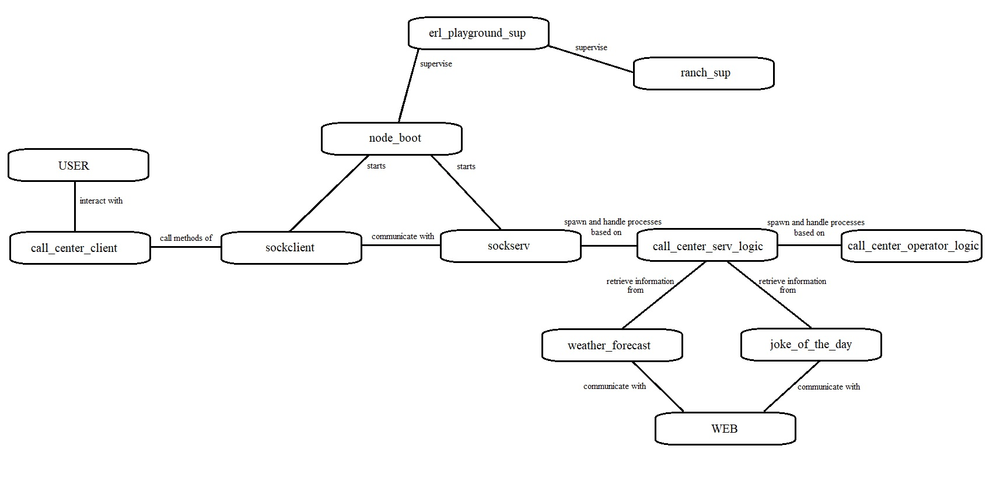

# erl_playground

An OTP application to start coding without the boring stuff.

## Prerequisites
This project has been written for Mac and Linux environments, theoretically speaking it can run on any environment where a Erlang system is correcty installed, but consider that MS Windows and Erlang are not best buddies. Nowadays it is pretty easy to have Linux systems running in minutes using Virtual Machines, Containers, USB distro or simply double booting your laptop.

In case you use a Mac system, we strongly recommend using [homebrew](https://brew.sh/) to manage all your packages.

**OpenSSL**

Check the correct installation process for you environment.

**Erlang/OTP 21.3**

If you are on Mac, we strongly suggest using [kerl](https://github.com/kerl/kerl) to build and install the proper Erlang version on your system. For other environments you can easily find your installation package on [ErlangSolutions](https://www.erlang-solutions.com/).

## Build & Run

This is a [rebar3](https://www.rebar3.org/) project.

The command used to build the project is `rebar3 compile`.

The command used to run the project is `rebar3 shell`.

## Compile GPB

Google Protocol Buffer is automatically compiled starting from the included proto file.
[Here](https://developers.google.com/protocol-buffers/) you can find all the information about it.

## What you have out of the box
This is a playgrounf application that allows you to focus on the logic of your system, rather than the boring technical stuff. It includes a basic Erlang/OTP application structure with a TCP client and a TCP server.

# Candidate comments
I am Simone Lutero and this is my implementation of a call-center simulator, based on the application erl_playground.

## Implemented features
You can use this application to simulate a call to a call center, which provide you the following features:

1. Get tomorrow weather forecast for Genoa (Italy).
2. Get a random joke.
3. Get the call ID.
4. Ask for an operator who can tell you his Pid or say if a number is even or odd.

The **call_center_client** module provide a few simple functions with wich the user can interact with the server, connecting and disconnecting to it and sending messages.

## How it works?
The **erl_playground** application starts a supervisor which handles two processes that run **node_boot** and **ranch_sup**.

**ranch_sup** must be started to make ranch listeners available.

The **node_boot** module reads from *sys.config* the environment variable *boot_node* and start **sockclient** and **sockserv** based on this value which can be:

* client_server: both client and server will be started.
* only_server: only the server will be started.
* only_client: only the client will be started.

After this, user is ready to interact with the module **call_center_client** and the firt things he has to do are to create a connection using function *connect/0* and initiate a call providing his username with the method *login/1*.

**sockclient** take the address and the port of the listening host from *sys.config*, then enstabilshes connection with it and send the create_session message enveloped as a google protocol buffers message to the server.

When **sockserv** module receive messages it opens them and process the content; in case of create_session message it spawn a new process which will run the method *handle_client* of **call_center_serv_logic** module, registering it with the *Username* he received.

The *handle_client* method is an automatic responder, when it spawns it shows a menu with the possible actions it can do in response to the requests it handles.

To send a message user must use the function *send_message/2* of **call_center_client**, providing as attributes his Username and the content of the message to send; like the create_session message during login also this client_message will be enveloped and sent by **sockclient** to **sockserv**.

If the automatic responder recognize an accepted message it elaborates the response and send it to **sockclient** using the client socket.

In case of request of weather forecast or random joke the *handle_client* process calls methods of modules that interact with web API through http protocol and return the obtained results.

If the user choose to speak to an operator the *handle_client* process spawns a new process that acts as defined in the **call_center_operator_logic** module.

This operator has a timeout of 10 seconds and a max number of response (3), then it terminate itself.

When the operator is active the *handle_client* process becomes a bridge between **sockserv** and **operator** process, passing client messages from the first one to the second one, until the termination of **operator** process.

When the client decide to disconnect he has to call the *logout/1* method providing his username, or he can close session and connection with the *disconnect/1* method; this will result in a close_session message the will make the *handle_client* process exit and will interrupt the connection to the server.

## Diagram

